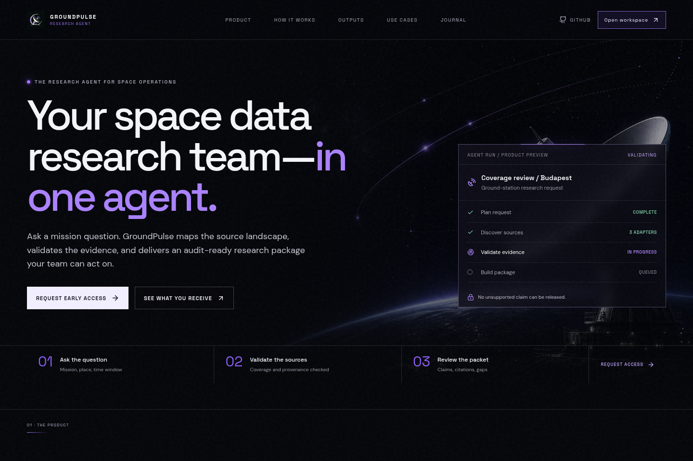
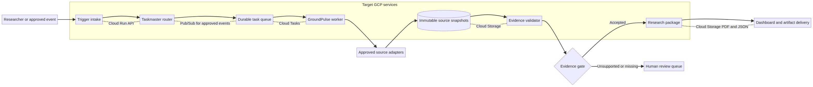
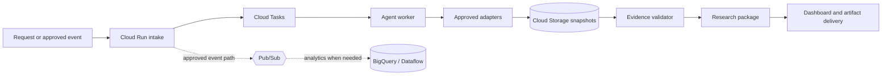

# GroundPulse Research Agent

> **An evidence-first, event-driven research coordinator for satellite and ground-segment questions.**

[](docs/TASKMASTER_TRACK.md)
[](docs/LIMITATIONS.md)
[](docs/GCP_REALTIME_INTEGRATION_PLAN.md)
[](LICENSE)

GroundPulse Research Agent is a hackathon-ready product prototype and implementation blueprint. It turns a structured space-data research question into a controlled evidence workflow: discover approved sources, validate fitness and provenance, preserve gaps, and prepare a reviewable research package. The intended output is not free-form text; it is a **Research Evidence Package** comprising a brief, claim ledger, source trail, JSON manifest, and explicit limitations.



> **Honest status:** The landing page, Mission Control dashboard, Research Journal, documentation, task system, and product assets are implemented in this repository. The event triggers, GCP services, external adapters, live telemetry, and released research packages below are target implementation work. They are **not** claimed as live capabilities.

## Why this is a Taskmaster project

The Taskmaster focus is an event-driven system that observes a change, determines the next permitted work, coordinates tools, and delivers a result with appropriate review boundaries. GroundPulse applies that model to research operations: a user request or approved event starts a durable run; the coordinator routes controlled source and validation tasks; the evidence gate either releases a traceable package or creates a visible human-review task.



| Taskmaster capability | GroundPulse response | Prototype vs. target |
|---|---|---|
| **Trigger** | Structured research request, source-freshness change, or approved partner event. | UI request flow is implemented locally; external triggers are planned. |
| **Autonomous routing** | Select discovery, validation, freshness, or package tasks based on scope and source policy. | Operating model and task contracts are documented; worker routing is planned. |
| **Tool action** | Approved adapters preserve source snapshots and metadata before findings are considered. | Adapter contracts are planned. |
| **End-to-end artifact** | Research Brief PDF, Claim Ledger, JSON Manifest, and Gap List. | Artifact contract is documented; generation is planned. |
| **Human boundary** | Unsupported, unavailable, or consequential findings remain visible and require review. | Product rule and UI pattern are implemented/documented. |

Read the complete [Taskmaster track alignment](docs/TASKMASTER_TRACK.md) and [Taskmaster operating model](docs/TASKMASTER_OPERATING_MODEL.md).

## Product surfaces included now

| Surface | Route | Current repository state |
|---|---|---|
| **Product landing page** | `/` | Implemented static frontend explaining the workflow and use cases. |
| **Mission Control dashboard** | `/dashboard` | Implemented local interactive prototype; all values are illustrative UI content. |
| **Research Journal** | `/journal/claim-ledger` | Implemented editorial and methodology pages. |
| **New research panel** | Dashboard modal | Implemented local interaction only; it does not create a cloud job. |
| **GCP architecture** | Documentation and diagram | Target implementation only; no cloud resources are provisioned here. |

## Live UI prototype

The current UI/UX prototype is externally accessible for hackathon review. These links expose the implemented frontend only; their dashboard values remain local prototype content, not a live agent or telemetry feed.

| Surface | External URL |
|---|---|
| **Product landing page** | [groundpulse-utlcmcmd.manus.space](https://groundpulse-utlcmcmd.manus.space) |
| **Mission Control dashboard** | [groundpulse-utlcmcmd.manus.space/dashboard](https://groundpulse-utlcmcmd.manus.space/dashboard) |

## Target GCP architecture

The target deployment separates public-facing request intake, durable task dispatch, agent workers, approved source adapters, evidence validation, and immutable artifacts. Cloud Run is the target for request-facing services and agent workers; Cloud Tasks is the target queue for asynchronous work; Cloud Storage holds raw snapshots and released artifacts; Pub/Sub supports approved event distribution; BigQuery or Dataflow is added only when streaming analytics requires it. See the detailed [GCP Real-Time Integration Plan](docs/GCP_REALTIME_INTEGRATION_PLAN.md) and [Architecture](docs/ARCHITECTURE.md).



### Architecture constraints

GroundPulse must expose freshness instead of assuming it. Public-source context is labeled *near-real-time* only when the provider cadence and retrieval timestamps support that label. **Live operational telemetry** is reserved for an owned or contracted feed with a documented schema, authorization, retention policy, and end-to-end test. Details and source-specific boundaries are in the [GCP plan](docs/GCP_REALTIME_INTEGRATION_PLAN.md).

## Implementation plan and tasks

The project is intentionally organized as a transparent progression from prototype to verified MVP. Every target task is written with an acceptance condition and a non-claim boundary.

| Milestone | Main work | Representative tasks | State |
|---|---|---|---|
| **P0 — Foundation** | Interface, documentation, scope control, CI. | `GP-001`–`GP-003` | Complete prototype work. |
| **P1 — Run model** | Request schema, run ID, event contract, durable states. | `GP-010`, `GP-015` | Planned. |
| **P2 — Source controls** | Adapter registry, retrieval policy, snapshots, manifests. | `GP-011`, `GP-012`, `GP-016` | Planned. |
| **P3 — Evidence gate** | Claim ledger, validation, gaps, human review. | `GP-013`, `GP-014`, `GP-017` | Planned. |
| **P4 — Research package** | PDF, JSON manifest, citations, checksums, access control. | `GP-020`–`GP-022` | Planned. |
| **P5 — GCP and event routing** | IaC, Cloud Run, Cloud Tasks, Pub/Sub, freshness analytics. | `GP-030`–`GP-034` | Planned target. |

The [Implementation Plan](docs/IMPLEMENTATION_PLAN.md) explains milestone gates. The [Task Backlog](docs/TASKS.md) is the source of truth for work items. For each new issue, use the [Taskmaster work-item template](.github/ISSUE_TEMPLATE/taskmaster-work-item.md): it requires a trigger, allowed tools, output artifact, human-review boundary, acceptance evidence, and non-claims.

## Intended use case

The first narrow use case is **evidence preparation for satellite and ground-segment research**. A team frames an object, location, time window, source constraint, and decision intent. GroundPulse is designed to reduce repetitive discovery, validation, documentation, and reporting work while preserving the evidence needed for a specialist to review the output.

| Input | GroundPulse responsibility | Human specialist responsibility |
|---|---|---|
| Structured question, location/object, time window, decision intent | Create bounded work, preserve provenance, report gaps, and prepare package artifacts. | Set the question and assess the outcome in operational context. |
| Public orbit, observation, or weather context | Preserve source identity, timestamps, terms, and derivation inputs. | Decide suitability for mission, safety, performance, or operational action. |
| Partner telemetry | Accept only after contract, schema, authorization, and validation controls. | Own the feed and retain final operational authority. |

## Quick start

**Prerequisites:** Node.js 20+, pnpm, and Git.

```bash
git clone https://github.com/ousssamarahmani/Groundpulse-Research-Agent.git
cd Groundpulse-Research-Agent
pnpm install
pnpm dev
```

Open the Vite URL shown in the terminal. The available frontend routes are `/`, `/dashboard`, and `/journal/claim-ledger`.

```bash
pnpm check
pnpm build
```

## Documentation index

| Document | Purpose |
|---|---|
| [Taskmaster track alignment](docs/TASKMASTER_TRACK.md) | Explains the event-driven track fit and proof boundaries. |
| [Taskmaster operating model](docs/TASKMASTER_OPERATING_MODEL.md) | Defines triggers, routing, evidence gates, human review, and issue discipline. |
| [Technical Architecture Guide (DOCX)](docs/GroundPulse_Technical_Architecture_Guide_EN.docx) | Imported technical architecture reference, preserved unchanged from the supplied project documentation. |
| [Architecture](docs/ARCHITECTURE.md) | Defines product components and target service boundaries. |
| [GCP real-time integration plan](docs/GCP_REALTIME_INTEGRATION_PLAN.md) | Detailed GCP target design, event contract, safety, cost, and rollout. |
| [Implementation plan](docs/IMPLEMENTATION_PLAN.md) | Milestones and release gates from prototype to verified MVP. |
| [Task backlog](docs/TASKS.md) | Acceptance-oriented IDs, status, and delivery work. |
| [Hackathon submission](docs/HACKATHON_SUBMISSION.md) | Problem, solution, demo story, and honest current scope. |
| [Demo guide](docs/DEMO.md) | A safe presentation script for the implemented prototype. |
| [Limitations](docs/LIMITATIONS.md) | Explicit technical, data, and operational non-claims. |

## Principles

GroundPulse follows four non-negotiable principles. **Evidence before language** means no generated statement is stronger than its evidence. **Provenance before aggregation** means source identity and transformation history are retained. **Missing means missing** means unavailable data remains visible rather than silently imputed. **Human review before operational decision** means GroundPulse accelerates specialist work but never assumes the authority of an engineering or operations team.

## Contributing and security

Read [CONTRIBUTING.md](CONTRIBUTING.md), select an item from [docs/TASKS.md](docs/TASKS.md), and review [SECURITY.md](SECURITY.md) before opening an issue or pull request. Contributions must preserve prototype boundaries and evidence quality.

## License

This repository is released under the [MIT License](LICENSE). External source data, when later integrated, retains its own license, terms, attribution, and permitted-use boundaries.
