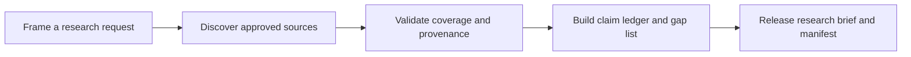

# GroundPulse Research Agent

> **An evidence-first research agent for satellite and ground-segment questions.**

GroundPulse Research Agent is a prototype product and implementation blueprint for turning a structured space-data research question into a reviewable evidence package. The intended output is not a free-form answer: it is a traceable package comprising a research brief, claim ledger, source trail, manifest, and explicit data gaps.


## Why GroundPulse

Space and ground-segment teams frequently assemble decision context across public catalogs, observation networks, space-weather products, internal notes, and engineering assumptions. The difficult part is not retrieval alone. It is preserving provenance, time coverage, source terms, transformations, and uncertainty while preventing a convenient summary from becoming an unsupported claim.

GroundPulse is designed to make that work more structured. A user frames a question with an object, location, time window, and decision intent. The agent path discovers approved sources, validates fitness, retains unresolved gaps, and produces a package that a human specialist can inspect before making an engineering or operational decision.

> **Prototype boundary:** This repository includes a functional product-interface prototype and implementation documentation. It does **not** include a live deployed agent, live telemetry, a reviewed source collection, empirical performance findings, or a production GCP integration.

## Product preview

| Surface | Purpose | Current repository state |
|---|---|---|
| **Product landing page** | Explains the research-agent workflow, evidence package, and intended use cases. | Implemented as a static frontend experience. |
| **Mission Control dashboard** | Demonstrates mission state, source review, claim status, visible data gaps, and package status. | Local interactive prototype state only; values are illustrative UI content, not live mission data. |
| **Research Journal** | Explains the product’s evidence-first concepts through reusable editorial pages. | Implemented as product and methodology content. |
| **GCP plan** | Defines a target architecture for asynchronous research runs and source-freshness analytics. | Documentation only; no cloud resources are provisioned by this repository. |

## Core workflow



The workflow is deliberately gated. GroundPulse should release only source-backed evidence, traceable derivations, clearly labeled proposals, or visible gaps. It must not invent operational measurements, telemetry, RF values, anomaly labels, or engineering conclusions.

## Intended use case

The initial use case is **evidence preparation for satellite and ground-segment research**. A team may ask for available context around an orbital object, a ground-station location, a time window, or a space-weather condition. GroundPulse is intended to reduce repetitive discovery, validation, documentation, and reporting work; it does not replace a CubeSat analyst, aerospace engineer, GIS engineer, or SpaceTech engineer.

| Input | GroundPulse responsibility | Human responsibility |
|---|---|---|
| Structured question, location/object, time window, decision intent | Source discovery, provenance capture, fitness checks, gap reporting, package generation. | Set the question and review the outcome in context. |
| Public orbit or observation context | Preserve source identity, timestamps, terms, and derived-result inputs. | Validate suitability for mission, safety, performance, or operational decisions. |
| Customer or partner telemetry | Accept only after a documented contract, schema, authorization, and validation gate. | Own the feed, validate its meaning, and retain final operational authority. |

## Repository map

```text
client/                         React + Vite product interface prototype
server/                         Static deployment compatibility server
shared/                         Shared frontend compatibility types
docs/                           Architecture, plan, task backlog, demo, limitations, and GCP plan
assets/previews/                Current interface captures for README and hackathon review
.github/workflows/              CI validation workflow
CONTRIBUTING.md                 Contribution and evidence-quality requirements
SECURITY.md                     Vulnerability reporting policy
CITATION.cff                    Citation metadata
```

## Quick start

**Prerequisites:** Node.js 20+, pnpm, and Git.

```bash
git clone https://github.com/<your-account>/GroundPulse-Research-Agent.git
cd GroundPulse-Research-Agent
pnpm install
pnpm dev
```

Open the local Vite URL shown in the terminal. The primary routes are `/`, `/dashboard`, and `/journal/claim-ledger`.

```bash
pnpm check
pnpm build
```

## Documentation

| Document | Description |
|---|---|
| [Hackathon submission](docs/HACKATHON_SUBMISSION.md) | Problem, solution, demo scope, and honest current status. |
| [Architecture](docs/ARCHITECTURE.md) | Product and target-service boundaries. |
| [Implementation plan](docs/IMPLEMENTATION_PLAN.md) | Phased path from prototype to verified MVP. |
| [Task backlog](docs/TASKS.md) | Acceptance-oriented work items. |
| [GCP integration plan](docs/GCP_REALTIME_INTEGRATION_PLAN.md) | Target design for asynchronous runs and source-freshness analytics. |
| [Demo guide](docs/DEMO.md) | How to present the interface without overstating capabilities. |
| [Limitations](docs/LIMITATIONS.md) | Explicit technical, data, and operational non-claims. |

## Research and product principles

GroundPulse follows four non-negotiable principles. **Evidence before language** means no generated sentence is stronger than its evidence. **Provenance before aggregation** means source identity and transformation history are preserved. **Missing means missing** means unavailable data remains visible rather than silently imputed. **Human review before operational decision** means the product accelerates specialist work but never assumes the authority of an engineering or operations team.

## Contributing

Contributions are welcome when they preserve the evidence model and current scope. Please read [CONTRIBUTING.md](CONTRIBUTING.md), select an item from [docs/TASKS.md](docs/TASKS.md), and review [SECURITY.md](SECURITY.md) before opening an issue or pull request.

## License

This repository is released under the [MIT License](LICENSE). External source data, when later integrated, retains its own license, terms, attribution, and permitted-use boundaries.
