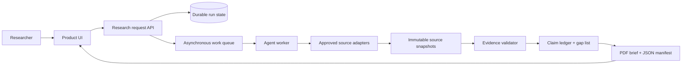

# Architecture

> For the event-driven Taskmaster workflow and the rendered GCP diagram, see [Taskmaster Track Alignment](TASKMASTER_TRACK.md), [Taskmaster Operating Model](TASKMASTER_OPERATING_MODEL.md), and [`assets/diagrams/taskmaster-gcp-flow.png`](../assets/diagrams/taskmaster-gcp-flow.png).

## System intent

GroundPulse is designed as an evidence-first research workflow, not as an unrestricted answer generator. The target architecture separates user intake, durable run state, background work, source adapters, evidence validation, and immutable package artifacts. This separation is essential because a research package must show what was found, what was accepted, what was derived, and what remains unavailable.

## Component responsibilities

| Component | Responsibility | Must not do |
|---|---|---|
| **Product UI** | Collect structured questions, display run state, evidence state, gaps, and released artifacts. | Expose secrets or present prototype values as live data. |
| **Request API** | Validate input, assign run ID, persist accepted request state, and enqueue work. | Perform unbounded source retrieval within a user request. |
| **Agent worker** | Plan source calls, collect allowed snapshots, propose structured findings, and request validation. | Release unsupported claims or bypass source policies. |
| **Source adapters** | Retrieve a defined source class, preserve its identity and timestamps, and enforce provider policy. | Convert public context into proprietary telemetry or absent measurements. |
| **Evidence validator** | Evaluate fitness, provenance, transformations, citations, and gaps. | Quietly infer missing values. |
| **Artifact service** | Build a stable PDF/JSON package with manifest and checksums. | Mutate a released package without a new version. |

## Claim model

Every package statement must carry one of four states. **Source-backed** means an accepted source directly supports it. **Derived** means retained, reproducible inputs support the calculation. **Proposed** means it is a next action, not a finding. **Unavailable** means a required data element was not obtained or did not pass validation. The last state is a product output, not an error to conceal.

## Target GCP mapping

The documented target deployment uses Cloud Run for request-facing services and workers, Cloud Tasks for background orchestration, a state store for runs and evidence metadata, Cloud Storage for raw snapshots and artifacts, Pub/Sub for event distribution, and BigQuery for analytical history. This is a **target architecture**, not a claim that the repository currently deploys these services. See [GCP_REALTIME_INTEGRATION_PLAN.md](GCP_REALTIME_INTEGRATION_PLAN.md) and the rendered [Taskmaster GCP diagram](../assets/diagrams/taskmaster-gcp-flow.png).
