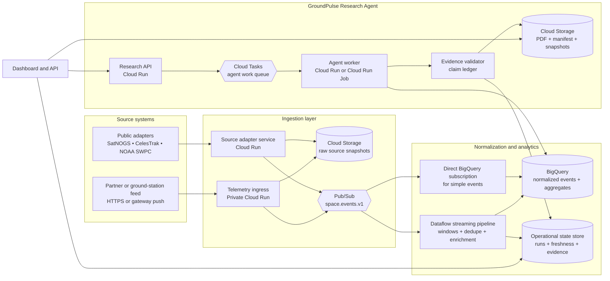

# GroundPulse: GCP Integration Plan for Live Space Analytics

**Status:** Reference plan for MVP and early production  
**Objective:** Deploy GroundPulse as an evidence-first Research Agent with a separate, traceable pipeline for live and near-real-time space-data analytics.

> **Governing rule:** *Real-time* must never be a marketing label detached from the source. The product must show the source, source-event timestamp, retrieval timestamp, freshness class, and source limitations for every operationally relevant item. Public context does not become live telemetry simply because it appears in a dashboard.

## 1. Architecture decision

GroundPulse should operate through two connected but logically separate paths. The first is the **Research Agent path**: it receives a structured question, collects and validates evidence, and releases a reviewable research package. The second is the **Space Event Analytics path**: it receives source snapshots or events, normalizes them, and preserves them for time-based analysis. The separation prevents raw stream data from being treated as an engineering conclusion and keeps every finding traceable to a source record.

| Decision area | Recommended approach | Reason |
|---|---|---|
| **Public-source freshness** | Label it **near-real-time** and expose a freshness badge. | Public providers publish at their own cadence. CelesTrak, for example, states that it checks for new GP data every two hours and asks clients not to poll more often. [9] |
| **Operational real-time** | Reserve this label for a customer-owned or partner-owned ground-station, payload, or mission feed with an explicit push contract. | This is the only case where the system can preserve an event timestamp close to the actual measurement time. |
| **UI and mission state** | Maintain a small operational state store, while keeping raw source payloads and released artifacts immutable. | The dashboard needs fast status reads; evidence packages need snapshots and manifests that remain reviewable. |
| **Stream processing** | Start with direct analytical ingestion for independent events. Add Dataflow when event-time windows, joins, deduplication, or streaming enrichment are necessary. | Google Cloud supports direct Pub/Sub-to-BigQuery ingestion and positions Dataflow for more comprehensive streaming pipelines. [1] [5] |

## 2. Viable deployment paths

The correct level of complexity depends on the feed GroundPulse actually owns or is permitted to consume. The lightest path is appropriate for evidence-first research; the later paths introduce streaming analytics and customer or partner telemetry.

| Approach | What it delivers | Trade-offs | Cost and setup complexity |
|---|---|---|---|
| **A. Evidence MVP** | Cloud Run Research Agent, asynchronous jobs, scheduled REST source adapters, immutable snapshots, and PDF/JSON research packages. | Supports defensible research and near-real-time source context; it must not claim live telemetry. | Lowest cost and fastest implementation. |
| **B. Streaming Analytics** | Adds Pub/Sub, Dataflow, and BigQuery for event normalization, windows, freshness metrics, and time-series analysis. | Requires schema discipline, lag monitoring, and duplicate handling. | Moderate operating complexity. |
| **C. Partner Telemetry** | Adds secure ingestion for a customer or partner ground-station feed and near-immediate dashboard status. | Requires a source contract, authentication, stable event schema, and end-to-end verification. | Highest integration effort; this is the only path that supports an operational real-time claim. |

## 3. Reference GCP architecture



Pub/Sub is the event bus because it decouples event producers from consumers and distributes events asynchronously; Google describes it as a scalable messaging service for streaming analytics and service integration, with typical latency on the order of hundreds of milliseconds. [1] Cloud Run hosts the ingestion and Research Agent APIs. Cloud Tasks isolates slow or rate-limited background work from the user request path and supports authenticated HTTPS invocation with OIDC. [3] [4]

## 4. Data flow from source to research package

### 4.1 Source adapters

Each provider needs an independent adapter that writes an **immutable source snapshot** before publishing an event. The SatNOGS adapter should preserve the source URL, license, retrieval time, and observation or scheduled-job context; SatNOGS documents a REST API for those resources and states that the API data are openly distributed under CC BY-SA. [8]

The CelesTrak adapter should retrieve GP/OMM data in a supported format such as JSON or CSV while honoring the provider cadence. It must stop repeated retries on persistent HTTP errors and create an operator incident rather than continue polling. [9] The NOAA SWPC adapter should record both the product timestamp and the GroundPulse retrieval timestamp. SWPC publishes products and JSON data, but those products must be presented as space-weather context—not as customer spacecraft telemetry. [10]

| Source | What enters GroundPulse | Correct UI label | Boundary that must remain visible |
|---|---|---|---|
| **SatNOGS** | Observation and job context with source link, license, and retrieval time. | `Public observation context` with freshness. | It does not automatically confirm a customer payload or station condition. |
| **CelesTrak** | GP/OMM orbit context and the published epoch. | `Orbit context / near-real-time` with snapshot age. | Do not claim second-by-second data; provider cadence is the freshness ceiling. |
| **NOAA SWPC** | Space-weather product and product timestamp. | `Space-weather context` with product timestamp. | Do not present it as spacecraft telemetry or a flight-safety decision. |
| **Partner telemetry** | Signed, time-stamped event payload from an owned or contracted system. | `Operational telemetry` after schema and contract validation. | Do not ingest a feed before defining authentication, schema, retention, and ownership. |

### 4.2 Canonical event contract

Every event should be versioned. The stable identifier and timestamps are required for replay, deduplication, source provenance, and defensible freshness reporting.

```json
{
  "event_id": "uuid-or-source-stable-id",
  "schema_version": "space-event.v1",
  "source": "approved-source-id",
  "source_event_at": "2026-08-15T00:00:00Z",
  "retrieved_at": "2026-08-15T00:00:05Z",
  "ingested_at": "2026-08-15T00:00:06Z",
  "event_type": "orbit_context | observation | space_weather | telemetry",
  "object_ref": "source-qualified-object-id",
  "payload_uri": "gs://.../raw/...",
  "payload_sha256": "content-hash",
  "source_url": "https://...",
  "license": "declared-license-or-contract",
  "freshness_class": "live | near_live | historical",
  "validation_state": "raw | normalized | accepted | rejected"
}
```

Pub/Sub is at-least-once by default, so each consumer must be idempotent on `event_id` or a stable source key. When Dataflow is used, exactly-once streaming mode can handle duplicate messages; the event timestamp must still be supplied explicitly when it differs from the Pub/Sub receipt timestamp. [2]

### 4.3 Analytics layer

For the first MVP, write simple events to BigQuery and retain raw snapshots in Cloud Storage. Introduce Dataflow only when the product needs event-time windows, duplicate reconciliation, joins between orbit and space-weather context, or streaming aggregation. The Dataflow pipeline is deterministic data processing; it must remain separate from the agent worker that writes a research package.

| Storage layer | Responsibility | Retention design |
|---|---|---|
| **Cloud Storage** | Raw payloads, source snapshots, PDFs, and JSON manifests. | Use object versioning and lifecycle rules; do not mutate a released artifact. |
| **BigQuery** | Normalized events, aggregates, freshness queries, and historical analytics. | Partition by `source_event_at` and cluster by `source` and `object_ref`. |
| **Operational state store** | Run status, agent stages, evidence links, package links, and freshness state. | Keep it small and operational; it is not the raw-stream warehouse. |

## 5. Research Agent and Evidence Package path

The Research API receives a structured scope, object or location, time window, and decision intent. It saves the request under a `run_id` and enqueues background work. Cloud Tasks is appropriate for rate-limiting third-party source calls, preserving queued work through incidents, and keeping slow agent operations out of a user-facing request; Google documents this pattern for private Cloud Run services with OIDC authentication. [3]

The agent worker must not issue a final claim until the validator has accepted source-backed evidence or recorded a derivation whose inputs are retained. A completed run produces the following package.

| Artifact | Required content | Purpose |
|---|---|---|
| **Research Brief PDF** | Scope, findings, citations, limitations, and gap list. | Human-readable review and sharing. |
| **Claim Ledger** | Each claim, its state, and supporting source or derivation. | Technical review and audit. |
| **JSON Manifest** | Run ID, schema versions, source snapshots, hashes, and timestamps. | Reproducibility and programmatic integration. |
| **Freshness Panel** | Latest event, source time, data age, and adapter state. | Prevents confusion between live, near-live, and historical data. |

## 6. Phased delivery plan

| Phase | Scope | Exit criterion |
|---|---|---|
| **0 — Baseline** | GCP project and region, infrastructure as code, separate service accounts, buckets, schema registry, and CI/CD. | No secrets in application code and least-privilege service identity is enforced. |
| **1 — Evidence MVP** | Research API, queue, worker, SatNOGS/CelesTrak/SWPC adapters, snapshot storage, and PDF/JSON output. | Every released report links claims to a source snapshot and an explicit gap list. |
| **2 — Streaming path** | Pub/Sub topics, normalizer, BigQuery tables, and a source-freshness dashboard. | UI exposes `source_event_at`, `ingested_at`, and lag for every event class. |
| **3 — Advanced analytics** | Dataflow windows, deduplication, and enrichment only when needed; analytical views and alerts. | A replay test proves that aggregates are not duplicated, or that the sink is idempotent. |
| **4 — Partner telemetry** | Ingress contract, test harness, rate limits, partner authentication, and operations runbook. | A documented end-to-end test uses an owned or contracted feed; production contains no synthetic telemetry. |

## 7. Security, reliability, and observability

Security is part of evidence quality. Keep Cloud Run services private where possible, use separate service accounts for ingestion, the agent worker, analytics, and artifact writing, and never expose source API credentials in the dashboard client. Apply an approved-source allowlist, retain structured audit records for requests and artifacts, and avoid logging sensitive payloads.

Operationally, the live path must be measured by **source freshness**, not by API uptime alone. Dataflow exposes system lag, job state, element counts, and custom metrics through Cloud Monitoring; alerts can be built for failed jobs and high streaming lag. [7] BigQuery provides workload metrics, audit logs, and `INFORMATION_SCHEMA` views for jobs and streaming errors, but some query metrics can take up to seven minutes to appear, so they must not be the only “live” signal in the UI. [6]

| Measurement category | MVP target | Action on failure |
|---|---|---|
| **Adapter freshness** | A source-specific budget that does not exceed the provider cadence. | Mark the source `stale`, block dependent claims, and display a gap. |
| **Ingestion integrity** | Unique event ID and readable raw snapshot. | Quarantine schema-invalid events and create an adapter incident. |
| **Streaming lag** | Set only after load testing; do not invent an SLA. | Alert, follow a scale or replay runbook, and reduce non-critical enrichment. |
| **Package integrity** | Every artifact has a manifest, hash, and valid evidence links. | Do not release the PDF until validation succeeds. |

## 8. Cost discipline

Start with a small number of sources and separate topics by data class. Do not run Dataflow simply because the product uses the word “real-time”; direct Pub/Sub ingestion into BigQuery is appropriate for simple events, while Dataflow earns its operating cost when event-time processing is genuinely required. [5] Apply Cloud Storage lifecycle policies, partition and cluster analytical tables, and set a retention window for debug payloads. Never poll a provider every minute when that provider does not update every minute.

## 9. Decision required before implementation

Before this plan becomes Terraform and deployed services, select the initial data posture: **public near-real-time sources only**, or **an owned/contracted ground-station or partner telemetry feed**. This single decision determines whether GroundPulse starts with Approach A, extends immediately into Approach B, or includes Approach C in the MVP.

> **Recommended external positioning:** “GroundPulse is deployed on GCP for asynchronous, traceable research runs and source-freshness analytics.” Do not say “live spacecraft telemetry” until a real, owned or contracted event feed has passed an end-to-end verification test.

## References

[1]: [Google Cloud Pub/Sub overview](https://docs.cloud.google.com/pubsub/docs/overview)
[2]: [Google Cloud Dataflow: Read from Pub/Sub](https://docs.cloud.google.com/dataflow/docs/concepts/streaming-with-cloud-pubsub)
[3]: [Google Cloud Run: Executing asynchronous tasks](https://docs.cloud.google.com/run/docs/triggering/using-tasks)
[4]: [Google Cloud Run: Use Pub/Sub with Cloud Run](https://docs.cloud.google.com/run/docs/tutorials/pubsub)
[5]: [Google Cloud BigQuery](https://cloud.google.com/bigquery)
[6]: [Google Cloud BigQuery monitoring](https://docs.cloud.google.com/bigquery/docs/monitoring)
[7]: [Google Cloud Dataflow monitoring](https://docs.cloud.google.com/dataflow/docs/guides/using-cloud-monitoring)
[8]: [SatNOGS Network API](https://docs.satnogs.org/projects/satnogs-network/en/latest/api.html)
[9]: [CelesTrak GP data formats and queries](https://celestrak.org/NORAD/documentation/gp-data-formats.php)
[10]: [NOAA SWPC Data Access](https://www.spaceweather.gov/content/data-access)
