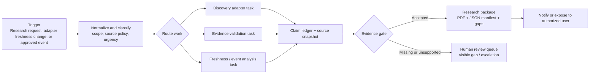

# Taskmaster Track Alignment

## Track thesis

GroundPulse fits the **Taskmaster** track as an evidence-first, event-driven research coordinator for satellite and ground-segment work. Its intended job is to observe a change or accept a structured research request, decide which controlled work must happen next, route work to the appropriate source adapters and validators, and produce a reviewable artifact. It does not represent an unconstrained autonomous system, and it does not make engineering or operational decisions without an explicit human review boundary.

> **Current status:** The repository contains the interface prototype, architecture, task model, and implementation plan. The event triggers, cloud services, external integrations, and autonomous actions described below are target implementation work—not a claim that they are live today.

## GroundPulse Taskmaster loop



The task model deliberately distinguishes **trigger**, **routing**, **tool action**, **evidence gate**, and **human review**. A trigger does not release a claim by itself. A routed worker can retrieve or validate a source only under an approved adapter policy. The evidence gate either releases a package with traceable evidence or routes the unresolved work to a visible human-review queue.

| Taskmaster requirement | GroundPulse design response | Current repository evidence |
|---|---|---|
| **Event-driven trigger** | A structured request, source freshness event, or approved partner event creates a durable research run. | Target event model in [Architecture](ARCHITECTURE.md) and [GCP plan](GCP_REALTIME_INTEGRATION_PLAN.md). |
| **Autonomous routing** | The coordinator selects discovery, validation, freshness, or package tasks from request scope and source policy. | Workflow and task states in the dashboard prototype and [Tasks](TASKS.md). |
| **Multi-tool action** | Workers use approved source adapters and artifact services; future integrations must retain source policy and audit metadata. | Source-adapter requirements in [Implementation Plan](IMPLEMENTATION_PLAN.md). |
| **End-to-end outcome** | A research brief, claim ledger, manifest, and gap list are generated or an explicit escalation is recorded. | Output contract in [Architecture](ARCHITECTURE.md) and [Demo guide](DEMO.md). |
| **Human approval boundary** | Unsupported, unavailable, or consequential items remain visible and block release or require review. | [Limitations](LIMITATIONS.md) and evidence-gate requirements. |

## Target event contract

Every future trigger must preserve its origin and freshness. The minimum contract is below; it allows the coordinator to decide whether to start a new run, attach new context to an existing run, mark a source stale, or request human review.

```json
{
  "event_id": "stable-source-id-or-uuid",
  "event_type": "research_request | source_freshness | approved_partner_event",
  "source": "approved-source-or-authorized-system",
  "source_event_at": "RFC3339 timestamp or null",
  "received_at": "RFC3339 timestamp",
  "research_scope_ref": "run-or-request-id",
  "freshness_class": "live | near_live | historical",
  "authorization_state": "approved | rejected | review_required",
  "payload_snapshot_uri": "immutable-storage-reference"
}
```

## Google Cloud implementation path

The initial target uses Cloud Run for request-facing services and workers, Cloud Tasks for durable asynchronous work, Cloud Storage for immutable artifacts, and a state store for runs and evidence metadata. For higher-volume analytics, Pub/Sub provides event distribution and BigQuery or Dataflow can process normalized events. Google documents Cloud Run deployment for ADK agents, while its current Agent Platform documentation describes managed runtime, registry, identity, gateway, and observability capabilities that may become relevant at the governed-enterprise stage. [1] [2]

The reference event-driven pattern is **detect → route → investigate → review or package**. Google’s event-driven data-agent example uses continuous detection, Pub/Sub routing, and an ADK agent, with a human escalation route for cases that should not resolve autonomously. GroundPulse adapts that pattern to source freshness and research evidence rather than financial anomaly decisions. [3]

| Increment | Implementation objective | Success condition |
|---|---|---|
| **MVP trigger** | User submits one structured research request. | A durable run ID and a queued work item exist. |
| **Source task** | Approved adapters retrieve snapshots under source policy. | Each record retains source identity, timestamps, terms, and checksum. |
| **Evidence gate** | Validator categorizes findings as source-backed, derived, proposed, or unavailable. | Unsupported claims cannot enter a released package. |
| **Taskmaster routing** | Event class determines the next permitted worker or review path. | Each route is logged and can be replayed. |
| **Streaming extension** | Freshness or authorized partner events create scoped research actions. | UI shows event time, ingest time, and freshness; it never invents telemetry. |

## Task tracking model

The issue and implementation model is intentionally concrete. Use the following labels in GitHub Issues or Taskmaster: `track:taskmaster`, `area:trigger`, `area:routing`, `area:adapter`, `area:evidence`, `area:artifact`, `area:gcp`, `risk:source-policy`, and `needs:human-review`. Every issue should name its trigger, inputs, allowed tools, output artifact, failure path, and acceptance evidence.

The authoritative execution backlog is [TASKS.md](TASKS.md). The repository uses task identifiers such as `GP-010` for durable work items. The recommended first Taskmaster issue is **GP-010: define `research_request` and `research_run` schemas**, because a coordinator cannot route work safely before a run has a stable identity, scope, and state model.

## References

[1]: [Gemini Enterprise Agent Platform — Agents overview](https://docs.cloud.google.com/gemini-enterprise-agent-platform/agents)
[2]: [Google Cloud Run — Build and deploy an AI agent using ADK](https://docs.cloud.google.com/run/docs/ai/build-and-deploy-ai-agents/deploy-adk-agent)
[3]: [Google Cloud Blog — Building event-driven data agents with BigQuery, Pub/Sub, and ADK](https://cloud.google.com/blog/topics/developers-practitioners/building-event-driven-data-agents-with-bigquery-pubsub-and-adk)
